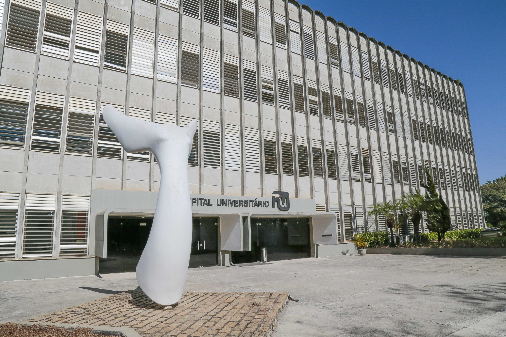
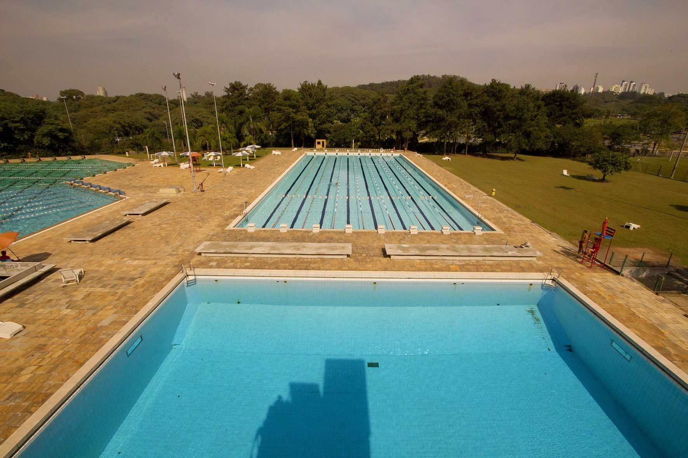
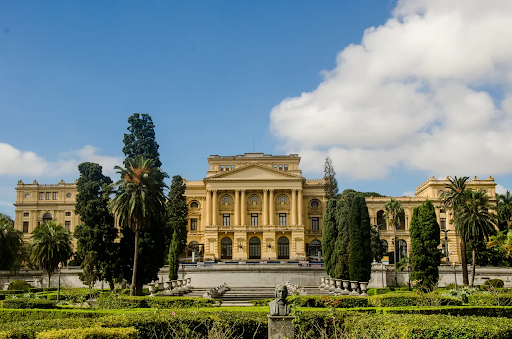

<!--
-------------------------------------------------------------------------------
This file defines the contents of each slide.
The reveal.js configuration can be found in index.html
-------------------------------------------------------------------------------
-->

<!-- .slide: class="slide-title" data-background-image="assets/logos/escudo_urania/urania_cinza.png" data-background-color="#000000" data-background-opacity="0.3" data-background-size="contain" -->

<!-- Place the content at the bottom of the slide -->

<h1 id="talk-title">
  Vivenciando a Pós-Graduação em Geofísica 
</h1>
<h2>Benefícios Universitários<h2>

  <a href="https://github.com/yagoMCastro" id="talk-speaker">Yago Moreira Castro</a>,<a href="https://github.com/arthursmacedo">
  Arthur Siqueira de Macêdo</a> &
  Victor Sacek

<!-- Place location and date side-by-side with affiliation logos -->

<i class="fa fa-calendar-alt" style="margin: 0 10px 0 0"></i>
13 de Março de 2025

<!-- Permission to reuse and CC-BY license logo -->
<i class="fa fa-camera" style="margin: 0 10px 0 0"></i>
Sinta-se livre para compartilhar e reutilizar esta apresentação

<a href="https://creativecommons.org/licenses/by/4.0/"><i class="fab fa-creative-commons"></i><i class="fab fa-creative-commons-by" style="margin: 0 10px 0 2px"></i>CC-BY 4.0 License</a>

<!-- Add logos here. Need these wrappers to align them to the bottom right -->

  
  

===============================================================================
<!-- .slide:  data-background-image="assets/praca_relogio.jpg" data-background-size="contain" data-background-opacity="0.3" data-background-color="#ffffff"  -->

# PROGRAMA DE APOIO À PERMANÊNCIA E FORMAÇÃO ESTUDANTIL

===============================================================================

# PAPFE

- **Objetivo**: Promover condições para que estudantes em situação de vulnerabilidade socioeconômica possam concluir seus cursos, reduzindo a evasão e contribuindo para a formação acadêmica integral.

===============================================================================

# PAPFE

**Benefícios Oferecidos**
- Auxílio financeiro integral de R$850,00 mensais;
- Auxílio parcial de R$320,00 mensais para estudantes contemplados com vagas nas moradias estudantis da USP.  
- Refeições gratuitas nos restaurantes universitários para todos os beneficiários.  

===============================================================================
# PAPFE

**Público-Alvo**
- Estudantes com renda familiar per capita abaixo de 1,5 salário mínimo paulista.  
- Não podem ter concluído outra graduação na USP nem receber outro auxílio da Universidade.

🔗 [Mais informações](https://prip.usp.br/apoio-estudantil/) e [edital](https://prip.usp.br/wp-content/uploads/sites/1128/2024/12/EDITAL-PAPFE25-v-Final.pdf):  

===============================================================================
<!-- .slide:  data-background-image="assets/bilhete.png" data-background-size="contain" data-background-opacity="0.3" data-background-color="#ffffff"  -->

# PASSE ESCOLAR E CIRCULAR

===============================================================================

# BILHETE ÚNICO ESTUDANTE - SPTRANS

**Direito ao Benefício**
- Estudantes de pós-graduação têm direito à meia tarifa no transporte público municipal e no sistema de Trem e Metrô.  
- O benefício é concedido por meio do uso do **[Bilhete Único](https://estudante.sptrans.com.br/)**.

===============================================================================

# BILHETE ÚNICO ESTUDANTE - SPTRANS

**Como Solicitar**
1. A comprovação da matrícula é feita pela Unidade de Ensino.  
2. A unidade envia os dados do aluno à **[SPTrans](https://estudante.sptrans.com.br/
)** pelo caminho:
   - **[Janus](https://uspdigital.usp.br/janus/comum/) > Aluno Regular > Passe Escolar > Solicitar**

===============================================================================

<!-- .slide:  data-background-image="assets/raia.png" data-background-size="contain" data-background-opacity="0.3" data-background-color="#ffffff"  -->

# SAÚDE E BEM-ESTAR

===============================================================================

# ATENDIMENTO PSICOLÓGICO

- O Instituto de Psicologia da USP (IPUSP) oferece [atendimento psicológico gratuito](https://www.ip.usp.br/site/servicos-a-comunidade/) para a comunidade USP.

- **[ECOS:](https://prip.usp.br/programa-ecos/)** um programa de saúde com múltiplas frentes de ação:

  - Espaço de atendimento no campus Butantã

  - Escutas pontuais presenciais sem necessidade de agendamento

  - Reflexão e encaminhamentos para redes de cuidado interna ou externa à USP

  - Equipe composta por profissionais de saúde e alunes bolsistas de diversas áreas do conhecimento

===============================================================================
# HOSPITAL UNIVERSITÁRIO - HU

- **Emergência:** pronto-socorro disponível
- **Consultas Agendadas:** dermatologia, oftalmologia, psiquiatria, ginecologia e outras especialidades
- **Acesso:** necessário fazer o documento do hospital

🔗 [Mais informações](https://www.hu.usp.br/):  

===============================================================================

# Atendimento Odontológico para Alunos da USP

- **Quem tem direito?**
  - Alunos de graduação e pós + dependentes (cônjuges e filhos).

- **Serviços na Clínica Odontológica SAS**
  -  Emergências e rotina (cáries, limpezas, pequenas cirurgias) ✅
  -  Procedimentos complexos são encaminhados à Faculdade de Odontologia ❌

- **FUNDECTO** 
  - Exames e procedimentos com **50% de desconto**.

🔗 Mais informações: [Faculdade de Odontologia](https://bit.ly/31WPEYa), [Clínica SAS](https://sau.usp.br/clinica-odontologica) e [FUNDECTO](https://www.fundecto.com.br/pacientes/)

===============================================================================

# Esportes e Atividades no CEPEUSP

**Treinos e Cursos**
- O CEPEUSP sedia os treinos das modalidades esportivas da Atlética (AAAGW).  
- Oferece cursos como karatê, yoga, pilates, natação e mais.

🔗 [Mais informações](https://www.hu.usp.br/):[Cursos do CEPEUSP](https://cepe.usp.br/), [Instagram AAAGW:](https://www.instagram.com/aaaglebwataghin) e  [Facebook AAAGWUSP](https://www.facebook.com/AAAGWUSP)

===============================================================================

# Esportes e Atividades no CEPEUSP

**Piscinas**
- Piscinas olímpicas para prática esportiva.  
- Piscina recreativa disponível.  
-Acesso às piscinas requer exame dermatológico oferecido pela LAAUSP. 

🔗 [Mais informações](https://www.hu.usp.br/):[Cursos do CEPEUSP](https://cepe.usp.br/), [Instagram AAAGW:](https://www.instagram.com/aaaglebwataghin) e  [Facebook AAAGWUSP](https://www.facebook.com/AAAGWUSP)

===============================================================================

<iframe src="https://www.google.com/maps/d/u/0/embed?mid=1X8UORE0ertxI-7by9yGATz16nHj3zHA&ehbc=2E312F" height="998vh" width="10000vw"></iframe>

===============================================================================

<!-- .slide:  data-background-image="assets/apps.png" data-background-size="contain" data-background-opacity="0.8" data-background-color="#000000"  -->

<a href="https://jornal.usp.br/universidade/universidade-aplicativos/"><h1>APLICATIVOS</h1></a>

===============================================================================

<!-- .slide:  data-background-image="assets/masp.jpg" data-background-size="contain" data-background-opacity="0.8" data-background-color="#000000"  -->

# ARTE E CULTURA

===============================================================================

# ARTE E CULTURA

- [Teatro USP](http://www.usp.br/tusp/)
- [Cinema USP](http://www.usp.br/cinusp/)
- [Orquestra de Câmara da ECA](http://www.ocam.usp.br/)
- [Coral USP](http://coralusp.prceu.usp.br/ )
- [Filarmônica da USP](https://sites.ffclrp.usp.br/uspfilarmonica/)
- [Orquestra Sinfônica da USP](http://www.osusp.prceu.usp.br/)

  

===============================================================================

<!-- .slide:  data-background-image="assets/iag_aerea.jpg" data-background-size="contain" data-background-opacity="0.3" data-background-color="#000000"  -->

# Vantagens

===============================================================================
# Vantagens

- [GitHub Student Developer Pack](https://education.github.com/experiences/understanding_markdown)
- [Coursera for Campus](https://www.coursera.org/programs/universidade-de-sao-paulo-br-on-coursera-mvxtw)
- [CamScanner](https://www.camscanner.com/)
- [Notion](https://www.notion.so/)
- [Software da Autodesk](http://www3.fo.usp.br/wiki/index.php/Autodesk_Education?fbclid=IwAR14oF-aHHTcFnLr2SeEaBAq0w4NhHbMUUZZHJPpDtpETZW5gqkZlz0p0ZQ)
- [Spotify - 1 Mês Grátis - R$11,90](https://www.spotify.com/br-pt/student/)
- [Mubi - R$21.90](https://mubi.com/pt/br/student)

- [Pressreader](https://www.pressreader.com/catalog)
- [Tableau](https://www.tableau.com/pt-br/academic/students.)
- [Office 365 Education](https://www.microsoft.com/pt-br/education/products/office)
- [Lenovo](https://www.lenovo.com/br/pt/estudantes/)
- [Dell](https://www.dell.com/pt-br/lp/mpp-brasil)
- [Samsung 30% OFF](https://www.samsung.com/br/students-offers/)
- [Poliglota - 10%OFF](https://poliglotaidiomas.com/)

🔗 [Mais informações](https://jornal.usp.br/universidade/gratuidades-e-descontos-confira-as-vantagens-de-ser-aluno-da-usp/)  

===============================================================================
<!-- .slide:  data-background-image="assets/verao.png" data-background-size="contain"  data-background-color="#fffff"  -->

===============================================================================

<!-- .slide: data-background-opacity="0.3" data-background-image="assets/logos/escudo_urania/urania_cinza.png"  data-background-size="contain" data-background-color="#000000" -->

<i class="fas fa-comments"></i>
 
Contato:
 
<a>sacek@usp.br</a>
 
<a>arthursmacedo@usp.br</a>
 
<a>yagomcastro@usp.br</a>

<i class="fab fa-github"></i>
 
Código-fonte desta apresentação:
 
[https://github.com/YagoMCastro/vivenciando-pos-graduacao](https://github.com/YagoMCastro/vivenciando-pos-graduacao)

<i class="fab fa-creative-commons"></i><i class="fab fa-creative-commons-by"></i>
 
O conteúdo desta apresentação está
licenciado sob a
 
[Creative Commons Attribution 4.0 International License](https://creativecommons.org/licenses/by/4.0/).

