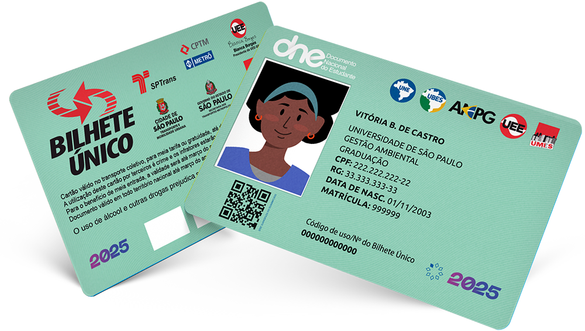

<!--
-------------------------------------------------------------------------------
This file defines the contents of each slide.
The reveal.js configuration can be found in index.html
-------------------------------------------------------------------------------
-->

<!-- .slide: class="slide-title" data-background-image="assets/title-slide.svg" data-background-color="#000000" data-background-size="contain" -->

<!-- Place the content at the bottom of the slide -->
<div class="r-stretch">
</div>

<h1 id="talk-title">
  Vivenciando a Pós-Graduação em Geofísica 
</h1>
<h2>Benefícios Universitários<h2>
<p id="talk-authors">
  <a href="https://github.com/yagoMCastro" id="talk-speaker">Yago Moreira Castro</a>,<a href="https://github.com/arthursmacedo">
  Arthur Siqueira de Macêdo</a> &
  Victor Sacek
</p>

<!-- Place location and date side-by-side with affiliation logos -->
<div class="row talk-info">
<div class="col-large">

<i class="fa fa-calendar-alt" style="margin: 0 10px 0 0"></i>
13 de Março de 2025
<span style="margin: 0 20px"></span>

<!-- Permission to reuse and CC-BY license logo -->
<i class="fa fa-camera" style="margin: 0 10px 0 0"></i>
Feel free to screenshot/share/reuse this presentation
<span style="margin: 0 20px"></span>
<a href="https://creativecommons.org/licenses/by/4.0/"><i class="fab fa-creative-commons"></i><i class="fab fa-creative-commons-by" style="margin: 0 10px 0 2px"></i>CC-BY 4.0 License</a>

</div>
<div class="col-medium">

<!-- Add logos here. Need these wrappers to align them to the bottom right -->
<div class="talk-logos-container">
<div class="talk-logos">
  <a href="https://www.iag.usp.br/"></a>
  <a href="https://www.usp.br/"></a>
</div>
</div>

</div>
</div>

===============================================================================

# PROGRAMA DE APOIO À PERMANÊNCIA E FORMAÇÃO ESTUDANTIL

===============================================================================

# PAPFE

<div class="row">
<div class="col">

- **Objetivo**: Promover condições para que estudantes em situação de vulnerabilidade socioeconômica possam concluir seus cursos, reduzindo a evasão e contribuindo para a formação acadêmica integral.

</div>
<div class="col tiny">

<a href="https://www.instagram.com/prip.usp/"></a>


</div>
</div>


===============================================================================

# PAPFE

<div class="row">
<div class="col">

**Benefícios Oferecidos**
- Auxílio financeiro integral de R$850,00 mensais;
- Auxílio parcial de R$320,00 mensais para estudantes contemplados com vagas nas moradias estudantis da USP.  
- Refeições gratuitas nos restaurantes universitários para todos os beneficiários.  
</div>
<div class="col tiny">

<a href="https://www.instagram.com/prip.usp/"></a>

</div>
</div>

===============================================================================
# PAPFE

<div class="row">
<div class="col">

**Público-Alvo**
- Estudantes com renda familiar per capita abaixo de 1,5 salário mínimo paulista.  
- Não podem ter concluído outra graduação na USP nem receber outro auxílio da Universidade.

<div class="footnote-center dark">

🔗 [Mais informações](https://prip.usp.br/apoio-estudantil/) e [edital](https://prip.usp.br/wp-content/uploads/sites/1128/2024/12/EDITAL-PAPFE25-v-Final.pdf):  

</div>
</div>
<div class="col tiny">

<a href="https://www.instagram.com/prip.usp/"></a>
</div>
</div>

===============================================================================
<!-- .slide:  data-background-image="assets/agu2019.svg" data-background-size="contain" data-background-opacity="0.3" data-background-color="#ffffff"  -->

# PASSE ESCOLAR E CIRCULAR


===============================================================================

# BILHETE ÚNICO ESTUDANTE - SPTRANS

<div class="row">
<div class="col">

**Direito ao Benefício**
- Estudantes de pós-graduação têm direito à meia tarifa no transporte público municipal e no sistema de Trem e Metrô.  
- O benefício é concedido por meio do uso do **[Bilhete Único](https://estudante.sptrans.com.br/)**.


</div>
<div class="col tiny">


<a href="https://estudante.sptrans.com.br/"></a>

</div>
</div>

===============================================================================

# BILHETE ÚNICO ESTUDANTE - SPTRANS

<div class="row">
<div class="col">


**Como Solicitar**
1. A comprovação da matrícula é feita pela Unidade de Ensino.  
2. A unidade envia os dados do aluno à **[SPTrans](https://estudante.sptrans.com.br/
)** pelo caminho:
   - **[Janus](https://uspdigital.usp.br/janus/comum/) > Aluno Regular > Passe Escolar > Solicitar**

</div>
<div class="col tiny">

<a href="https://estudante.sptrans.com.br/"></a>

</div>
</div>

===============================================================================

<!-- .slide:  data-background-image="assets/agu2019.svg" data-background-size="contain" data-background-opacity="0.3" data-background-color="#ffffff"  -->

# SAÚDE E BEM-ESTAR


===============================================================================

# ATENDIMENTO PSICOLÓGICO


- O Instituto de Psicologia da USP (IPUSP) oferece [atendimento psicológico gratuito](https://www.ip.usp.br/site/servicos-a-comunidade/) para a comunidade USP.


- **[ECOS:](https://prip.usp.br/programa-ecos/)** um programa de saúde com múltiplas frentes de ação:

  - Espaço de atendimento no campus Butantã

  - Escutas pontuais presenciais sem necessidade de agendamento

  - Reflexão e encaminhamentos para redes de cuidado interna ou externa à USP

  - Equipe composta por profissionais de saúde e alunes bolsistas de diversas áreas do conhecimento

===============================================================================
# HOSPITAL UNIVERSITÁRIO - HU

<div class="row">
<div class="col">

- **Emergência:** pronto-socorro disponível
- **Consultas Agendadas:** dermatologia, oftalmologia, psiquiatria, ginecologia e outras especialidades
- **Acesso:** necessário fazer o documento do hospital

<div class="footnote-center dark">

🔗 [Mais informações](https://www.hu.usp.br/):  

</div>

</div>
<div class="col tiny">

<a href="https://www.hu.usp.br/"></a>

</div>
</div>

===============================================================================

# Atendimento Odontológico para Alunos da USP

- **Quem tem direito?**
  - Alunos de graduação e pós + dependentes (cônjuges e filhos).

- **Serviços na Clínica Odontológica SAS**
  -  Emergências e rotina (cáries, limpezas, pequenas cirurgias) ✅
  -  Procedimentos complexos são encaminhados à Faculdade de Odontologia ❌

- **FUNDECTO** 
  - Exames e procedimentos com **50% de desconto**.

<div class="footnote-center dark">


🔗 Mais informações: [Faculdade de Odontologia](https://bit.ly/31WPEYa), [Clínica SAS](https://sau.usp.br/clinica-odontologica) e [FUNDECTO](https://www.fundecto.com.br/pacientes/)

</div>


===============================================================================

# Esportes e Atividades no CEPEUSP


<div class="row">
<div class="col">


**Treinos e Cursos**
- O CEPEUSP sedia os treinos das modalidades esportivas da Atlética (AAAGW).  
- Oferece cursos como karatê, yoga, pilates, natação e mais.


<div class="footnote-center dark">

🔗 [Mais informações](https://www.hu.usp.br/):[Cursos do CEPEUSP](https://cepe.usp.br/), [Instagram AAAGW:](https://www.instagram.com/aaaglebwataghin) e  [Facebook AAAGWUSP](https://www.facebook.com/AAAGWUSP)

</div>

</div>
<div class="col tiny">

<a href="https://www.hu.usp.br/"></a>

</div>
</div>

===============================================================================

# Esportes e Atividades no CEPEUSP


<div class="row">
<div class="col">


**Piscinas**
- Piscinas olímpicas para prática esportiva.  
- Piscina recreativa disponível.  
-Acesso às piscinas requer exame dermatológico oferecido pela LAAUSP. 

<div class="footnote-center dark">

🔗 [Mais informações](https://www.hu.usp.br/):[Cursos do CEPEUSP](https://cepe.usp.br/), [Instagram AAAGW:](https://www.instagram.com/aaaglebwataghin) e  [Facebook AAAGWUSP](https://www.facebook.com/AAAGWUSP)

</div>

</div>
<div class="col tiny">

<a href="https://www.hu.usp.br/"></a>

</div>
</div>

===============================================================================

# HOSPITAL UNIVERSITÁRIO - HU

<div class="row">
<div class="col">


</div> 

</div>
<div class="col tiny">

<a href="https://www.hu.usp.br/"></a>

</div>
</div>

===============================================================================

<iframe src="https://www.google.com/maps/d/u/0/embed?mid=1X8UORE0ertxI-7by9yGATz16nHj3zHA&ehbc=2E312F" height="998vh" width="10000vw"></iframe>

===============================================================================

<div class="r-stretch">

# Some facts

About a certain topic.

</div>
<div class="footnote">

This is a little footnote.
Use it to add notes, citations, [links](https://www.leouieda.com/), etc.
<br>
Notice how the `div` above uses `r-stretch` to push this note to the bottom.

</div>

===============================================================================

<div class="r-stretch centered">
<div>

# Even more facts!

About many different things.

</div>
</div>
<div class="footnote-left">

Left aligned footnote.
Use `centered` on the `div` above to vertically center content.
<br>
Need to put another `div` inside of it as well.

</div>

===============================================================================

<!-- .slide: data-background-image="assets/agu2019.svg" data-background-size="contain" data-background-color="#000000" -->

<div class="r-stretch">
</div>
<div class="footnote-center dark">

Centered footnote with a dark background on a slide with a background.
<br>
Set the size to `contain` to make sure aspect ratios are preserved and the
background isn't cropped.
<br>
It's a good idea to add alt-text to this footnote if the background is
important.

</div>

===============================================================================

<!-- .slide: data-background-video="assets/brasil-sao-paulo-rio.mp4" data-background-size="contain" data-background-color="#000000" -->

<div class="r-stretch">
</div>
<div class="footnote">

This is how you use a video background.
The video auto starts when flipping to this slide.

</div>

===============================================================================

<!-- .slide: class="slide-transition" -->

# A transition slide <br> with a large title

...and some text.

===============================================================================

# Maths

This is an inline $\int_a^b x^2 dx$ and $\delta g = g - \gamma$:

`\[ \int_a^b x^2 dx \]`

===============================================================================

<!-- .slide: data-background-image="assets/agu2019.svg" data-background-size="contain" data-background-opacity="0.3" data-background-color="#000000" -->

<div class="quote">

Big quote message with a faded background image.
Bla bla bla bla bla bla bla bla bla bla bla bla bla bla bla.

</div>

===============================================================================

<!-- .slide: data-background-image="assets/agu2019.svg" data-background-size="contain" data-background-opacity="0.3" data-background-color="#ffffff" -->

<div class="quote dark">

Light fade of the background with a dark quote.

</div>


<div class="r-stretch centered">
<div>

# Multiple columns

Place as many `col`s as you want. They will have the same size.

<div class="row">
<div class="col">

Bla bla bla bla bla bla bla bla bla bla bla bla bla bla bla bla bla bla bla bla
bla bla.

</div>
<div class="col tiny">


Bla bla bla bla bla bla bla bla bla bla bla bla bla bla bla bla bla bla bla bla
bla bla.

</div>
<div class="col tiny">


Bla bla bla bla bla bla bla bla bla bla bla bla bla bla bla bla bla bla bla bla
bla bla.

</div>
</div>

</div>
</div>
<div class="footnote">

Images by Leonardo Uieda (CC-BY).

</div>

===============================================================================

# This one has columns of different size

<div class="row">
<div class="col-large tiny">


This way the image is larger on the screen. Use it for maps or main figures.

</div>
<div class="col small">

Explain what is shown on the image.
Use the `small` class to adjust font size.

Maybe include some maths:

$ D\dfrac{\partial^4 w}{\partial x^4} = q - g (\rho_m - \rho_w) w $

</div>
</div>

===============================================================================

<div class="row">
<div class="col tiny">


This way the image is narrow so it should be in a smaller column.

</div>
<div class="col-medium">

# Column sizes

Columns come in 3 sizes:

1. `col`
1. `col-medium`
1. `col-large`

These are more proportions than fixed sizes.

</div>
</div>

===============================================================================

# Code

Example of using PyGMT to make a map:

<div class="row">
<div class="col-large fragment small">

This code:

```python
import pygmt

# Load built-in topography data
grid = pygmt.datasets.load_earth_relief()

fig = pygmt.Figure()
# Pseudo-color map of topography
fig.basemap(
    region=[-150, -30, -60, 60],
    projection="I-90/6i",
    frame=True,
)
fig.grdimage(grid=grid, cmap="viridis")
# Mask continents in dark grey
fig.coast(land="#333333")
# Display in Jupyter or pop-up window
fig.show()
```
</div>
<div class="col-medium fragment small">

Makes this map 👇


</div>

===============================================================================

<!-- .slide: class="slide-contact" data-background-image="assets/contact-slide.svg" data-background-size="contain" data-background-color="#000000" -->

<div class="r-stretch centered">
<div>

<i class="fas fa-comments"></i>
<br>
Contact:
<a href="https://www.leouieda.com">www.leouieda.com</a>

<i class="fab fa-github"></i>
<br>
Source code for this presentation:
<br>
[github.com/leouieda/talk-template](https://github.com/leouieda/talk-template)

<i class="fab fa-creative-commons"></i><i class="fab fa-creative-commons-by"></i>
<br>
Unless otherwise noted,
the contents of this presentation are
licensed under the
<br>
[Creative Commons Attribution 4.0 International License](https://creativecommons.org/licenses/by/4.0/).

</div>
</div>
<div class="footnote-left dark">

The background image is a Landsat 9 scene of the city of São Paulo, Brazil,
showing the USP campus in the center.

</div>
